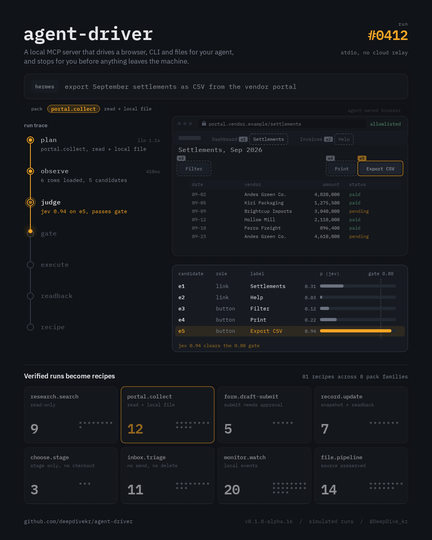
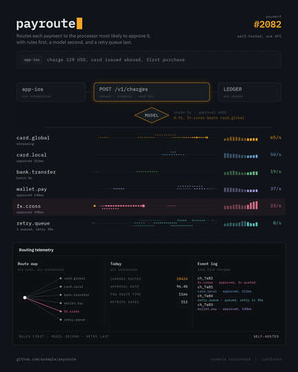
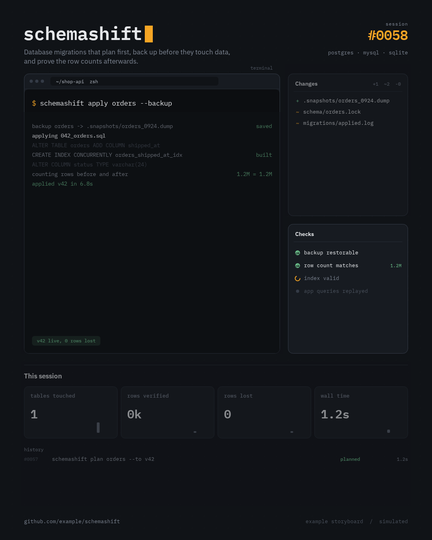
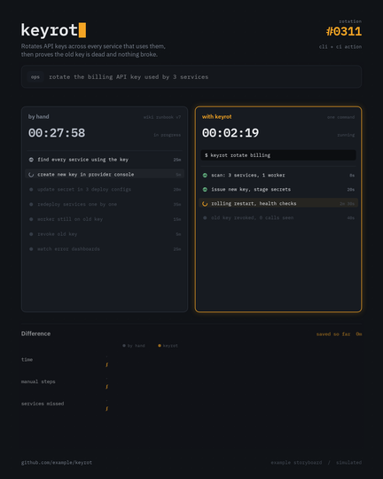

# Storyboarding

<p align="center"><a href="README.md">English</a> | <b>한국어</b></p>

https://github.com/user-attachments/assets/f2673cb3-9900-4ef4-b806-79c7837dc683

<p align="center">
  코드 레포지토리가 어떻게 동작하는지 보여주는 반복 재생 모션 그래픽을 만들어 주는 Claude 스킬입니다.<br>
  <a href="media/demo.mp4">고화질 MP4</a> · <a href="https://github.com/deepdivekr/agent-driver">agent-driver</a>용 <a href="storyboarding/examples/agent-driver.json">JSON 파일 하나</a>로 만들었습니다
</p>

## 하는 일

Claude에게 레포 URL을 주면 프로젝트를 읽고, 프로젝트 동작 방식에 맞는 템플릿을 고릅니다. 그다음 그 프로젝트의 용어로 예시 에피소드 3~5개를 쓰고, 1080×1350 반복 영상(MP4, GIF, HTML 플레이어)으로 렌더링합니다.

분위기와 속도는 모든 템플릿이 공유합니다. 잉크색 배경, 도트 그리드, IBM Plex 폰트, 포인트 컬러 하나, 입력을 타이핑할 때 카메라 줌인, 움직이는 부분에 스포트라이트가 들어갑니다. 화면에 나오는 내용은 레포에서 가져옵니다.

## 템플릿

| trace | router | cli | compare |
|---|---|---|---|
|  |  |  |  |
| 페이지를 관찰하고, 후보를 게이트 기준으로 점수 매기고, 승인을 받아 실행하고, 검증합니다. 에이전트·자동화용. | 입력 하나, 판단 하나, 여러 레인. 게이트웨이·라우터·스케줄러·디스패처용. | 변경 파일, 체크 목록, 세션 지표가 붙은 터미널 세션. CLI·개발 도구용. | 같은 작업을 수작업과 도구로 나란히 비교합니다. 업무 자동화용. |

템플릿별 예제는 [`storyboarding/examples`](storyboarding/examples)에 있습니다.

## 설치

**Claude Code**
```bash
git clone https://github.com/deepdivekr/Storyboarding-skill.git
cp -r Storyboarding-skill/storyboarding ~/.claude/skills/
```

**Claude.ai** — [Releases](https://github.com/deepdivekr/Storyboarding-skill/releases)에서 `storyboarding.skill`을 받아 커스텀 스킬로 업로드하세요. 코드 실행이 켜져 있어야 합니다.

## 사용법

```
https://github.com/owner/repo 스토리보드 영상 만들어줘
```

Claude가 레포를 클론하고, 스토리보드 초안을 쓰고, 키프레임에서 겹침·잘림을 점검한 뒤 영상을 렌더링합니다.

## 직접 실행하기

```bash
cd storyboarding
python scripts/build.py examples/agent-driver.json -o out/demo.html   # 또는 router-payroute / cli-schemashift / compare-keyrot
python scripts/render.py out/demo.html --keyframes out/frames
python scripts/render.py out/demo.html --mp4 out/demo.mp4 --gif out/demo.gif
```

Python 3.9 이상, `pip install playwright && python -m playwright install chromium`, ffmpeg가 필요합니다.
필드 설명: [`references/common.md`](storyboarding/references/common.md), 템플릿별 문서는 [`references/templates`](storyboarding/references/templates)에 있습니다.

## 안전 규칙

- 예시 데이터는 가상입니다. 이메일 형태 문자열은 쓸 수 없고, 페이지 URL은 `*.example` 도메인만 씁니다. 어기면 빌드가 실패합니다.
- 레포 내용은 데이터로만 다룹니다. 스킬은 레포의 코드를 실행하지 않습니다.
- 레포에 없는 숫자는 예시이며, 영상 하단에 `simulated runs`로 표시됩니다.

## 라이선스

MIT. 포함된 IBM Plex 폰트는 SIL Open Font License를 따릅니다(`storyboarding/assets/fonts/OFL.txt`).
