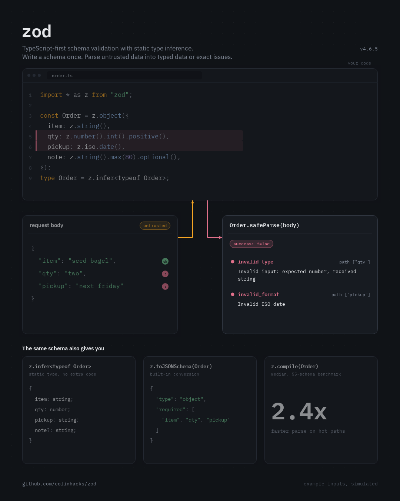

# Storyboarding

<p align="center"><b>English</b> | <a href="README.ko.md">한국어</a></p>

https://github.com/user-attachments/assets/f2673cb3-9900-4ef4-b806-79c7837dc683

<p align="center">
  A Claude skill that turns a code repository into a looping motion graphic of how it works.<br>
  <a href="media/demo.mp4">Full-quality MP4</a> · made from <a href="storyboarding/examples/agent-driver.json">one JSON file</a> for <a href="https://github.com/deepdivekr/agent-driver">agent-driver</a>
</p>

## What it does

Give Claude a repo URL. It reads the project, writes a shot list around what the project actually does, draws each shot with a shared motion kit, checks the keyframes, and renders a 1080×1350 loop (MP4, GIF and an HTML player).

The look and pace are fixed: ink background, dot grid, IBM Plex, one accent, a camera push onto what's typed, and a spotlight on whatever is moving. **What's on screen is designed for each repo**, so a validation library gets an editor and a parse result, and an agent gets a browser and an approval gate.

## Free scenes



For [zod](https://github.com/colinhacks/zod), the scene is an editor with the schema, a request body, and the `safeParse` result. One shot parses a valid order, and the next one gets `invalid_type` and `invalid_format` with zod's real messages. The last shot shows what the same schema also gives you. None of this layout existed before the repo was read. See [`examples/scene-zod`](storyboarding/examples/scene-zod).

Every render runs a layout check (text overlapping or off the canvas), and Claude reviews the keyframes before delivering.

<br clear="right">

## Reference designs

Four finished compositions. Claude borrows from them, and uses one as-is only when a repo fits it exactly.

| trace | router | cli | compare |
|---|---|---|---|
|  |  |  |  |
| Observes a page, scores candidates against a gate, asks for approval, acts, verifies. For agents and automation. | One input, a decision, many lanes. For gateways, routers, schedulers, dispatchers. | A terminal session with changed files, checks and session metrics. For CLIs and dev tools. | The same task by hand and with the tool, side by side. For workflow automation. |

Examples for each are in [`storyboarding/examples`](storyboarding/examples).

## Install

**Claude Code**
```bash
git clone https://github.com/deepdivekr/Storyboarding-skill.git
cp -r Storyboarding-skill/storyboarding ~/.claude/skills/
```

**Claude.ai** — upload `storyboarding.skill` as a custom skill. Code execution must be on.

## Use

```
Make a storyboard video for https://github.com/owner/repo
```

Claude clones the repo, drafts the storyboard, checks keyframes for layout problems, and renders the video.

## Run by hand

```bash
cd storyboarding
python scripts/build.py examples/scene-zod/storyboard.json -o out/demo.html   # free scene
python scripts/build.py examples/agent-driver.json -o out/demo.html          # or router-payroute / cli-schemashift / compare-keyrot
python scripts/render.py out/demo.html --keyframes out/frames
python scripts/render.py out/demo.html --mp4 out/demo.mp4 --gif out/demo.gif
```

Needs Python 3.9+, `pip install playwright && python -m playwright install chromium`, and ffmpeg.
Scene contract, layout and motion rules: [`references/kit.md`](storyboarding/references/kit.md). Shared fields: [`references/common.md`](storyboarding/references/common.md). Templates: [`references/templates`](storyboarding/references/templates).

## Guardrails

- Example data is fictional: no email-like strings, `*.example` hosts for page URLs, and the build fails otherwise.
- Repo contents are treated as data. The skill never runs the repo's code.
- Numbers that aren't in the repo are illustration, and the footer says `simulated runs`.

## License

MIT. Bundled IBM Plex fonts are under the SIL Open Font License (`storyboarding/assets/fonts/OFL.txt`).
